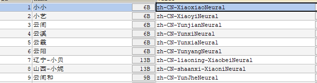

# 介绍

## 项目介绍

- 基于python:3.10、Django 4.2.13 的小说转语音 并且加背景音的服务
- 可以给小说加上想要的背景音，并支持选取读书者的声音
- 支持用户系统，支持token认证，支持后台任务
- 声音优美，可自定义，选择多
- 支持上传txt或者通过链接，由后台爬取（只适配了七猫），更多功能，可以自己拓展

## 截图

# 项目页面

## 选取文件


## 首页


## 详情页


## 更新


## 后台页面


## 音色

- 用的edge-tts 这里不全可以自己加



## iOS播放


# 注意

- 这只是后台服务，前端请参考 flutter实现的 https://github.com/JiJiBo/nas_ss_app.git
- 后台是两个服务，一个是做计算，用的django，一个做存储，中间用ftp做传输。
- 你的硬盘够用的话，可以使用一个服务器，但是需要自己修改一些东西。不要用ftp做传输

```angular2html
CreateAudioBookBase 的 is_to_ftp字段置为false（没有测试）
```

- 自行上传bgm文件，加在数据库里
- 自行在  [settings.py](nas_ss%2Fsettings.py)  设置 数据库配置 DATABASES

# 开始

## 装包

```angular2html
pip install -r requirements.txt -i https://pypi.tuna.tsinghua.edu.cn/simple
```

## 创建数据库

- 参见 sql/sql.sql 文件

## 迁移数据库

```angular2html
python manage.py inspectdb>./my_sql_db/models.py
```

# 如何运行

- windows

```angular2html
celery  -A nas_ss flower
celery -A nas_ss worker -l info
python manage.py runserver 0.0.0.0:8000 
```

- linux

1. 重启

```angular2html
./restart_services.sh
```

2. 开启接口服务器

- 里面会默认开启一个 pyss310 的 conda 环境
- 可以修改为自己的虚拟环境

```angular2html
./start_services.sh
```

3. 关闭

- 需要安装 killall

```angular2html
./stop_services.sh
```

# 声明

- 爬虫部分是由 https://github.com/shing-yu/7mao-novel-downloader.git 修改而来
- 由本人于2024年5月31日修改，适配我的需求

# 开源许可证

GPL